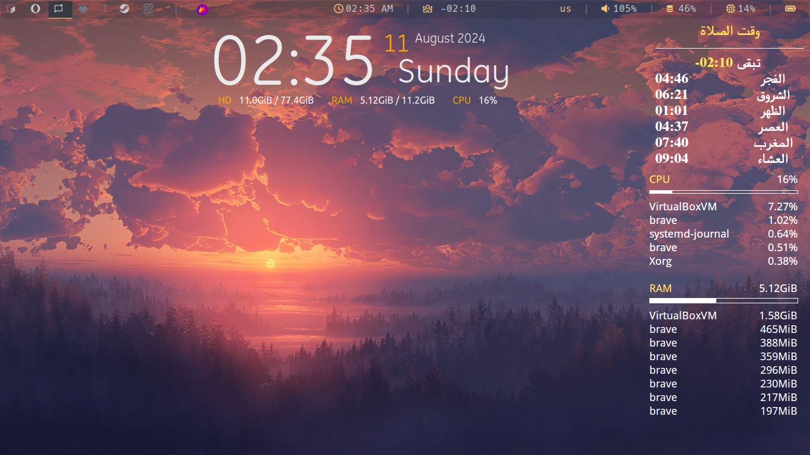

# conky-salah
اضافة لكونكي تظهر لك أوقات الصلاة لليوم والليلة والمتبقى على الصلاة القادمة

# Features
مفيش أفيد من كدا

# Requirements
- [Next-Salah](https://github.com/pxlman/Next-Salah) make an alias for running it at `~/.bashrc` or whatever which looks like `alias nsalah="python /path/to/Next-Salah/main.py"`
- FreeSerif Font
- And of Course Conky itself

# How to use
`conky -c /path/to/Salah`
if u faced any font problems just configure it as needed
Also if u want just the time remaining for the next salah just configure it too :D
